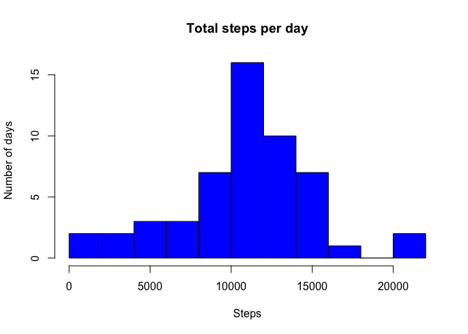
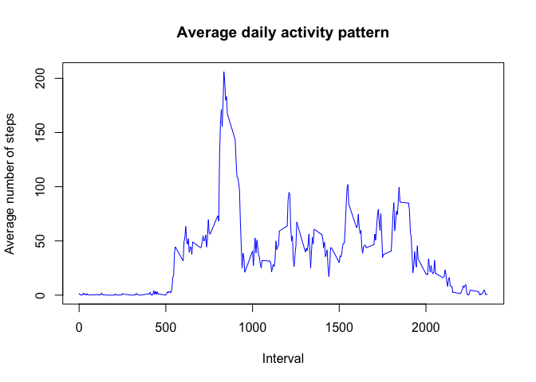
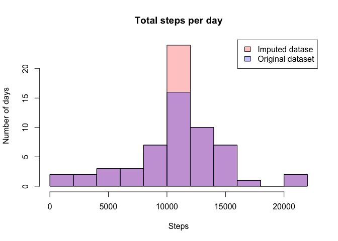

# Reproducible Research: Peer Assessment 1

This assignment makes use of data from a personal activity monitoring device. This device collects data at 5 minute intervals through out the day. The data consists of two months of data from an anonymous individual collected during the months of October and November, 2012 and include the number of steps taken in 5 minute intervals each day.

Dataset URL: https://d396qusza40orc.cloudfront.net/repdata%2Fdata%2Factivity.zip

The variables included in this dataset are:

steps: Number of steps taking in a 5-minute interval (missing values are coded as NA)

date: The date on which the measurement was taken in YYYY-MM-DD format

interval: Identifier for the 5-minute interval in which measurement was taken

The dataset is stored in a comma-separated-value (CSV) file and there are a total of 17,568 observations in this dataset.

## Loading and preprocessing the data

If dataset not avaliable then it could be downloaded with the following command:


```r
URL="https://d396qusza40orc.cloudfront.net/repdata%2Fdata%2Factivity.zip"
download.file(URL, destfile = "activity.zip", method="curl")
```

We assume that activity.csv file is already in our working directory or at least activity.zip file is present.


```r
if (file.exists("activity.csv")) {
  unzip(zipfile="activity.zip")
}
data = read.csv("activity.csv", colClasses=c("numeric", "Date", "integer"))
```

Dataset is read into variable **data** with steps and intervals as numerical types and dates as a Date type.

Portion of **data** table:


```r
head(data, 5)
```

```
##   steps       date interval
## 1    NA 2012-10-01        0
## 2    NA 2012-10-01        5
## 3    NA 2012-10-01       10
## 4    NA 2012-10-01       15
## 5    NA 2012-10-01       20
```

## What is mean and median total number of steps taken per day?


```r
library(dplyr)

## Calculate the total number of steps taken per day
total_per_day = summarize(group_by(data, date), sum(steps))

## Make a histogram of the total number of steps taken each day
hist(total_per_day[[2]], 10, main = "Total steps per day",
     xlab="Steps", ylab="Number of days", col="blue")
```

 

```r
## Calculate the mean and median of the total number of steps taken per day
mean_per_day = mean(total_per_day[[2]], na.rm=TRUE)
median_per_day <- median(total_per_day[[2]], na.rm=TRUE)
```

The mean total number of steps taken per day is 10766.19, the median total number of steps taken per day is 10765. 

The total number of steps taken per day is stored in **total_per_day** variable.


```r
total_per_day
```

```
## Source: local data frame [61 x 2]
## 
##          date sum(steps)
## 1  2012-10-01         NA
## 2  2012-10-02        126
## 3  2012-10-03      11352
## 4  2012-10-04      12116
## 5  2012-10-05      13294
## 6  2012-10-06      15420
## 7  2012-10-07      11015
## 8  2012-10-08         NA
## 9  2012-10-09      12811
## 10 2012-10-10       9900
## ..        ...        ...
```

## What is the average daily activity pattern?


```r
mean_per_interval <- summarize(group_by(data, interval), mean_steps=mean(steps,  na.rm=TRUE))

plot(mean_per_interval$interval, mean_per_interval[[2]],type="l",
     main="Average daily activity pattern", 
     xlab="Interval", ylab="Average number of steps", col="blue")
```

 

```r
## maximum number of steps
max_steps <- max(mean_per_interval[[2]])
## interval containing maximum number of steps
max_steps_interval = mean_per_interval[[1]][which.max(mean_per_interval[[2]])]
```

From the plot you can see that on average activity increase in the morning after 5:00, peak between 8:00 and 10:00 and declines after 20:00. This picture is in good correspondance with day rhythm of an average person. The maximum average number of steps is 206 and the corresponding 5-min interval is 835.

## Imputing missing values

**NA** values are only present in steps column. So we can use this column to calculate number of rows with **NA** values.


```r
## number of rows with NA
na_number <- sum(is.na(data$steps))
```

Total number of rows with NA is 2304.

I am going to use very simple strategy for imputing missing values. If there is a missing value then I will use average number of steps for this interval over all days.


```r
## create new table with mean_steps column containing 
## mean steps for a corresponding interval
imputed_data <- arrange(merge(data, mean_per_interval, by="interval"), date, interval)
## insert average values instead of NA in new column imputed_steps
imputed_data <- mutate(imputed_data, 
                       imputed_steps=ifelse(is.na(steps),
                                            mean_steps, 
                                            steps))

## create a new dataset that is equal to the original
## dataset but with the missing data filled in.
new_data <- data.frame(steps=imputed_data$imputed_steps, date=data$date, interval=data$interval)

## calculate a total number of steps taken each day
new_total_per_day <- summarize(group_by(new_data, date), sum(steps))

## make plots
hist(new_total_per_day[[2]], 10, main = "Total steps per day",
     xlab="Steps", ylab="Number of days", col=rgb(1,0,0,1/4))
hist(total_per_day[[2]], 10, main = "Total steps per day",
     xlab="Steps", ylab="Number of days", col=rgb(0,0,1,1/4), add=TRUE)
legend("topright", c("Imputed datase", "Original dataset"), fill=c(rgb(1,0,0,1/4), rgb(0,0,1,1/4)))
```

 

```r
## calculate the mean and median total number of steps taken per day
new_mean_per_day = mean(new_total_per_day[[2]], na.rm=TRUE)
new_median_per_day <- median(new_total_per_day[[2]], na.rm=TRUE)
```

For the imputed adtaset the mean total number of steps taken per day is 10766.19, the median total number of steps taken per day is 10766.19.

### Do these values differ from the estimates from the first part of the assignment?

The mean value is the same while the median have increased by roughly 1.

* Before imputing the data:
    + Mean : 10766.19
    + Median: 10765.00

* After imputing the data:
    + Mean : 10766.19
    + Median: 10766.19

### What is the impact of imputing missing data on the estimates of the total daily number of steps?

The data imputing resulted in adding days which contain average number of steps per interval. As results we have icresed number of days with the same averaged number of steps (imputed days). Due to increased number of these imputed days median now falls to one these days. For the chosen imputing strategy inpact seems to be rather small since mean is the same after imputing and median change is small.

## Are there differences in activity patterns between weekdays and weekends?


```r
## Create a new factor variable in the dataset 
## with two levels ??? ???weekday??? and ???weekend??? indicating whether
## a given date is a weekday or weekend day.
weekend <- c("Saturday", "Sunday")
new_data <- mutate(new_data, day_type = ifelse(weekdays(date) %in% weekend, "weekend", "weekday"))
new_data$day_type <- as.factor(new_data$day_type)

## Make a panel plot containing a time series plot of 
## the interval and the average number of steps taken
## averaged across all weekday days or weekend days.
weekday_data <- summarise(group_by(new_data, interval, day_type), mean_steps=mean(steps))
library(ggplot2)
g = ggplot(weekday_data, aes(interval, mean_steps)) +
  geom_line(col="blue") +
    facet_grid(day_type ~ .)
print(g)
```

 

The activity paterns are different. The morning activity peak in a weekend is no as high as in a weekday. During a weekend activity is more equaly distributed than during a weekday and on average there is more steps in a weekend between 10:00 and 20:00 than in a weekday.

